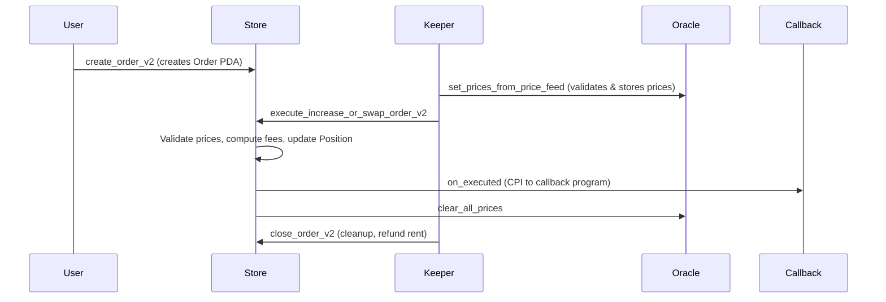

# GMX-Solana — Project Deep Dive

## What Is It?

**GMX-Solana** (`gmsol`) is a port/extension of [GMX V2](https://gmx.io) — a decentralised perpetual futures and spot-swap exchange — onto the **Solana** blockchain. It is written entirely in Rust using the **Anchor** framework (v0.31.1) on Solana v2.1.21, and is currently at version **0.11.0**.

> [!NOTE]
> GMX V2 was originally built on Arbitrum/Avalanche (EVM chains). This repo re-implements the same economic model on Solana, keeping the math identical while adapting to Solana's account model, parallel transaction execution, and native token standards.

---

## Repository Layout

```
gmx-solana/
├── programs/          # On-chain Anchor programs (deployed to Solana)
│   ├── store/             # Core: markets, orders, positions, oracle, GLV
│   ├── treasury/          # GT buyback & treasury management
│   ├── timelock/          # Time-locked governance instructions
│   ├── competition/       # Trading competition leaderboard (callback-based)
│   ├── liquidity-provider # LP token staking
│   ├── gt-incentive/      # GT reward minting incentives
│   ├── callback/          # Example callback interface program
│   └── mock-chainlink-verifier  # Test-only Chainlink mock
│
├── crates/            # Off-chain Rust libraries
│   ├── model/             # Pure math: GMX V2 model (no Anchor, no Solana deps)
│   ├── utils/             # Shared types reused by programs & SDK
│   ├── sdk/               # High-level client SDK (also compiles to WASM/JS)
│   ├── programs/          # Thin re-export of program types for SDK consumers
│   ├── solana-utils/      # RPC, bundle-builder, ALT helpers
│   ├── decode/            # Account/transaction decoder
│   ├── chainlink-datastreams/ # Chainlink Data Streams client
│   └── cli/               # `gmsol` command-line tool
│
├── tests/             # Integration test suite (Anchor tests)
├── examples/          # SDK usage examples
└── config/            # Deployment config files
```

---

## On-Chain Programs

### 1. `gmsol-store` — The Core Program
**Address:** `Gmso1uvJnLbawvw7yezdfCDcPydwW2s2iqG3w6MDucLo`

This is the heart of the protocol. It owns and manages all trading state.

#### Key Account Types

| Account | Purpose |
|---|---|
| `Store` | Global singleton per deployment; holds role table, GT state, global config |
| `TokenMap` | Maps tokens → price feed configs (Pyth, Chainlink, Switchboard) |
| `Market` | A trading pair (e.g., SOL-USDC). Holds pool balances, config, and market state |
| `Position` | A user's open leveraged position in a market |
| `Order` | Pending user action (market/limit increase/decrease/swap) |
| `Deposit` / `Withdrawal` / `Shift` | Pending liquidity actions |
| `Glv` / `GlvDeposit` / `GlvWithdrawal` / `GlvShift` | GLV vault and its actions |
| `UserHeader` | Per-user account: GT balance, esGT, referral code |
| `Oracle` | Temp account to hold validated prices during keeper execution |

#### Instruction Categories

```
Store Management       → initialize, transfer_authority, set_token_map
Role Management        → enable_role, grant_role, revoke_role, check_role
Config Management      → insert_amount, insert_factor, insert_address
Feature Flags          → toggle_feature (enable/disable individual actions)
Token / Oracle         → push_to_token_map, set_prices_from_price_feed, update_price_feed_with_chainlink
Market Management      → initialize_market, toggle_market, update_market_config
Exchange (Orders)      → create_order_v2, execute_increase/decrease_order_v2, liquidate, auto_deleverage
Liquidity (Deposits)   → create_deposit, execute_deposit, create_withdrawal, execute_withdrawal
GLV                    → initialize_glv, create_glv_deposit, execute_glv_shift, ...
GT Model               → initialize_gt, request_gt_exchange, confirm_gt_exchange_vault_v2
User / Referral        → prepare_user, initialize_referral_code, set_referrer
```

---

### 2. `gmsol-treasury`
**Address:** `GTuvYD5SxkTq4FLG6JV1FQ5dkczr1AfgDcBHaFsBdtBg`

Handles protocol fee collection and the **GT buyback** mechanism. When users exchange GT tokens, the treasury performs a buyback using accumulated fees (`sync_gt_bank_v2`, `confirm_gt_exchange_vault_v2`).

---

### 3. `gmsol-timelock`
**Address:** `TimeBQ7gQyWyQMD3bTteAdy7hTVDNWSwELdSVZHfSXL`

A governance safety mechanism. Sensitive admin instructions (role revocations, market config changes) can be scheduled with a **mandatory delay** before execution.

```
Flow:  TIMELOCK_KEEPER creates InstructionBuffer
       → Executors approve it
       → After delay expires, TIMELOCK_KEEPER executes it
       → TIMELOCK_ADMIN can cancel at any time
```

The timelock delay can only be **increased**, never decreased — a common anti-rug-pull pattern.

---

### 4. `gmsol-competition`
**Address:** `2AxuNr6euZPKQbTwNsLBjzFTZFAevA85F4PW9m9Dv8pc`

A **trading competition** program that hooks into the store via the **callback interface**:
- `on_created` — no-op (kept for interface compatibility)
- `on_executed` — updates participant stats and the leaderboard
- `on_closed` / `on_updated` — no-ops

Each participant gets a `Participant` PDA that tracks their trading volume. A `Competition` PDA holds global state including start/end time, volume thresholds, and dynamic end-time extension.

---

### 5. `gmsol-liquidity-provider` & `gmsol-gt-incentive`
Programs for staking LP tokens and minting GT rewards as protocol incentives.

---

## Off-Chain Crates

### `gmsol-model` — The Math Engine
A **pure Rust, no-Solana** crate implementing the GMX V2 economic model as generic traits:

| Trait | Meaning |
|---|---|
| `BaseMarket` | Pool balances, token config |
| `SwapMarket` / `SwapMarketMut` | Spot swap logic |
| `PerpMarket` / `PerpMarketMut` | Perpetual futures logic |
| `LiquidityMarket` | Deposit/withdrawal pricing |
| `BorrowingFeeMarket` | Borrowing fee calculations |
| `PositionImpactMarket` | Price impact on positions |
| `Position` / `PositionExt` | Per-position math |

This separation allows **off-chain simulation** (used by the SDK for pre-flight estimation) to use the exact same math as the on-chain programs.

### `gmsol-sdk` — The Client SDK
A high-level async SDK for interacting with all programs. It also compiles to **WASM** for JavaScript usage.

- `Client` struct wraps all RPC calls
- `ops::ExchangeOps` — create/execute orders, deposits, withdrawals
- `ops::StoreOps` — market config, role management
- `ops::GlvOps` — GLV lifecycle
- `ops::GtOps` — GT exchanges
- `simulation` module — off-chain simulation using `gmsol-model`
- `squads` module — Squads multisig integration
- `market_graph` — finds optimal swap routes

### `gmsol-cli`
A feature-rich CLI (`gmsol` binary) for operators and developers:

```bash
gmsol exchange create-order --market <TOKEN> --size <USD>
gmsol market update-config <MARKET> --key <KEY> --value <VAL>
gmsol gt status
gmsol glv inspect
gmsol alt extend       # Manage Address Lookup Tables
gmsol timelock create  # Propose timelock instructions
```

---

## Key Protocol Concepts

### Markets (GM Pools)
Each `Market` is a two-token pool (e.g., SOL/USDC) that:
- Provides liquidity for **spot swaps** and **leveraged longs/shorts**
- Issues **GM tokens** (market tokens) representing LP shares
- Tracks `long_pool` / `short_pool` balances, open interest, price impact pool, and borrowing state

### GLV (GMX Liquidity Vault)
A meta-pool that holds multiple GM tokens. Users deposit into GLV and get **GLV tokens** backed by a basket of markets. Keepers can **rebalance** via `GlvShift` to maintain target market weights.

### GT Token (Governance Token)
- Users earn GT by paying trading fees
- GT can be **exchanged** for protocol revenue (buyback via treasury)
- GT holders get fee discounts; referrers get a share
- GT minting is tracked per-market and governed by `gt_set_order_fee_discount_factors`

### Oracle Design
Prices are fetched from multiple providers and validated on-chain:

```
Pyth Network          ─┐
Chainlink Data Streams ─┼─→ Oracle account (temp) → used in execution
Switchboard On-Demand  ─┘
```

Each token in `TokenMap` has an **expected provider** — keepers must supply prices from that provider. A `max_deviation_ratio` guard allows cross-provider price deviation checks.

### Role-Based Access Control
The `Store` account holds a `RoleStore` with a flat permission table:

| Role | Who |
|---|---|
| `ADMIN` | Protocol multisig (Squads) |
| `MARKET_KEEPER` | Automated keepers |
| `ORDER_KEEPER` | Order execution bots |
| `CONFIG_KEEPER` | Config management bots |
| `FEATURE_KEEPER` | Feature flag managers |
| `TIMELOCK_ADMIN` | Timelock governance |
| `TREASURY_WITHDRAWER` | Treasury operators |

### Callback Interface
Programs can register a callback PDA that the store invokes on `on_created`, `on_updated`, `on_executed`, `on_closed` order lifecycle events. The `gmsol-competition` program uses this to track trading volumes without modifying the core store program.

---

## Transaction Lifecycle (Order Execution)



---

## Development Tooling

| Tool | Purpose |
|---|---|
| `anchor` | Build, test, deploy programs |
| `just` | Task runner (`just` runs all tests, `just cli` runs CLI) |
| `gmsol` CLI | Operator tool for on-chain interactions |
| JITO integration | MEV-aware bundle submission for keepers |
| Squads multisig | Admin key management |
| Address Lookup Tables (ALT) | Compress large account lists in keeper txns |

### Running Tests
```bash
just           # Run all tests
just cli       # Use gmsol CLI in dev mode
just install-cli  # Install gmsol binary globally
```

---

## Audit Status (as of v0.11.0)

All 5 public programs were audited by **Zenith** on 2026-01-20 at commit `6a5e6b2`:
- `gmsol-store` ✅
- `gmsol-treasury` ✅  
- `gmsol-timelock` ✅
- `gmsol-competition` ✅
- `gmsol-liquidity-provider` ✅

---

## Known Design Tradeoffs / Issues

> [!WARNING]
> These are documented in the README as known limitations, not bugs:

- **Keeper MEV**: A malicious keeper can manipulate execution order for limit orders with swap paths
- **GLV shift exploit**: Temporarily inflating market utilization before a shift can extract value
- **Negative pool value**: Rare scenario where impact pool + pending PnL exceeds pool worth
- **Virtual inventory grouping**: Tokens in the same virtual inventory group must have identical decimals
- **Price impact gaming**: High-leverage positions partially reduce price impact (mitigated by `MIN_COLLATERAL_FACTOR_FOR_OPEN_INTEREST_MULTIPLIER`)
